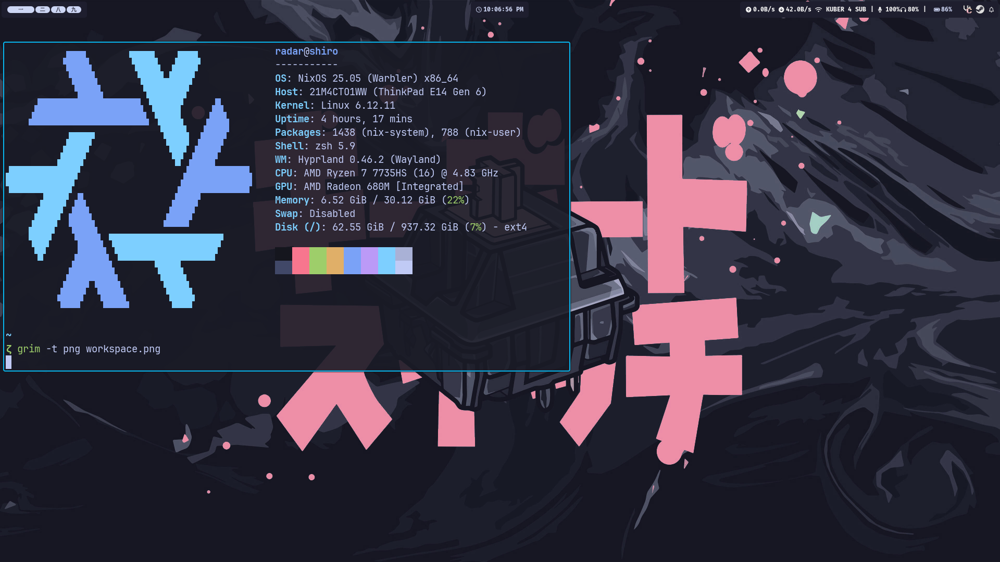

# Dotfiles

## Operating system
* [NixOS](https://nixos.org/)

## External package manager
* [Nix](https://nixos.org/)

## Terminal
* [Ghostty](https://ghostty.org/)

## Text editor
* [Neovim](https://neovim.io/)

## Shell
* [ZSH](https://www.zsh.org/)

## Terminal multiplexer
* [Tmux](https://github.com/tmux/tmux)

## File manager
* [Yazi](https://github.com/sxyazi/yazi) (TUI)

